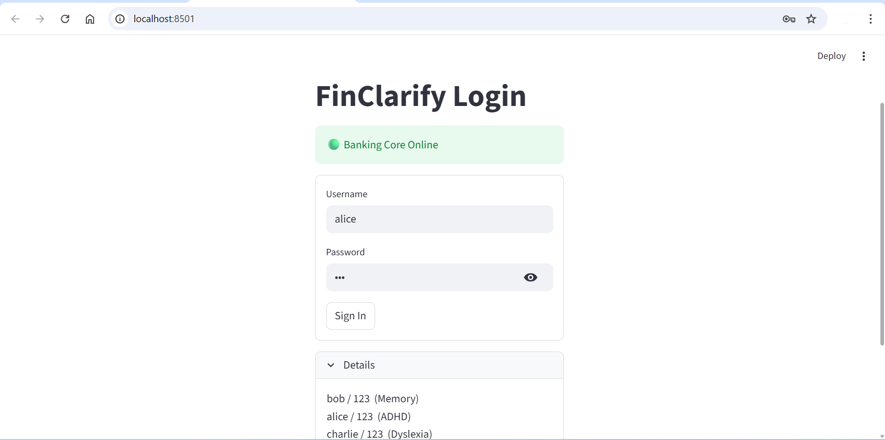
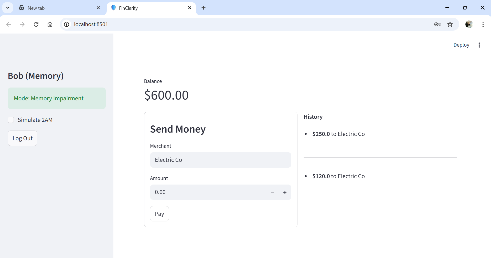
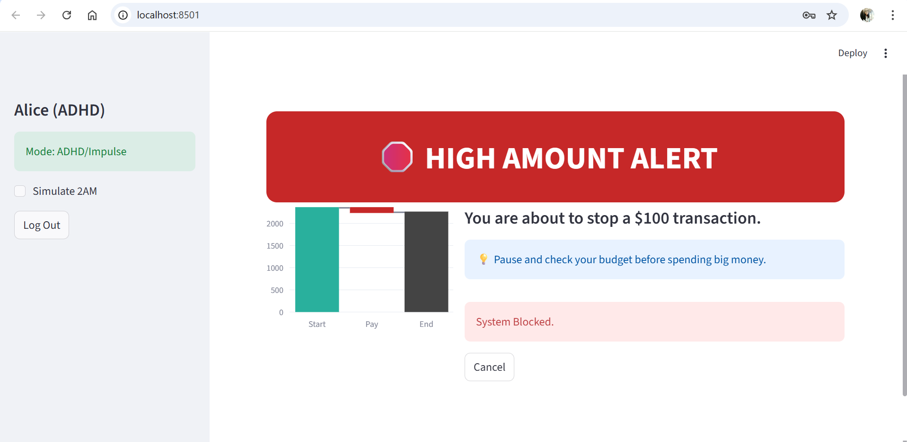
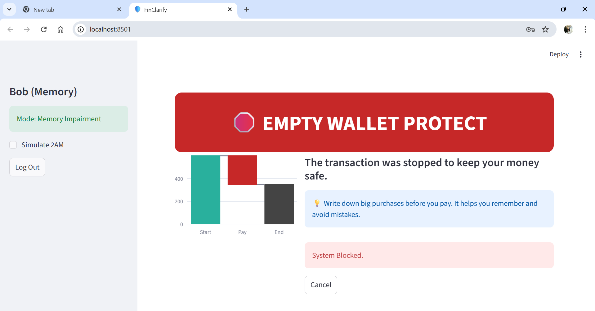
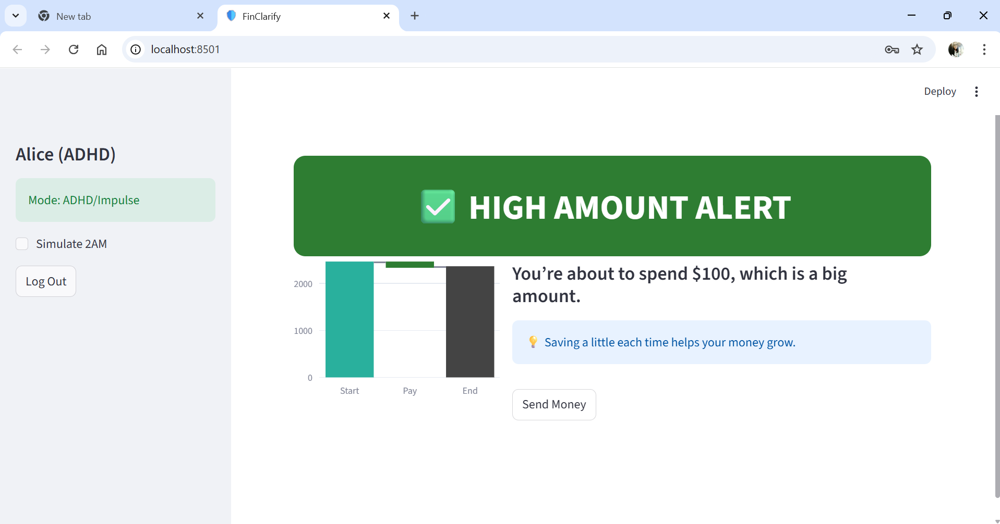

# FinClarify: Autonomous Financial Safeguard Platform for Inclusive Banking

**Project Name:** FinClarify

**Theme:** ACCESS.AI – AI for Accessibility & Inclusion

**Submission Category:** Intelligent Process Automation / AI Guardianship

---

## 1. Solution Philosophy: From Accommodation to Guardianship
Current digital banking transformations prioritize "frictionless" experiences—reducing clicks and speeding up payments. While efficient for the general population, this lack of friction creates a hostile environment for Persons with Disabilities (PwDs). A single accidental click, a moment of memory lapse, or a misunderstanding of banking jargon can lead to immediate financial loss (overdrafts, duplicate payments).

**FinClarify** does not simply make banking "readable" (Accommodation). It introduces a layer of **Autonomous Financial Guardianship**. It is a Zero-Trust Middleware that intercepts transaction attempts in real-time, validates them against the user’s specific disability profile using a Multi-Agent AI system, and autonomously intervenes—blocking, pausing, or simplifying the transaction before it affects the ledger.

---

## 2. Technical Solution Design: The "Agentic Swarm"
Unlike standard chatbots that provide text responses, FinClarify uses a **stateful Multi-Agent Architecture** built on **LangGraph**. This allows for "Separation of Concerns," ensuring that the empathy required for user communication never compromises the rigid logic required for financial security.

The decision pipeline operates in three discrete stages:

### Node 1: The Forensic Investigator (Logic Layer)
This agent performs deterministic checks against the Core Banking API. It has no "empathy"; it deals strictly in math and history logs.
*   **Role:** Anomaly Detection.
*   **Operations:**
    *   **Math Logic:** Calculates `Current Balance - Transaction Request`. Flags risk if the result is negative or exactly zero.
    *   **History Scraper:** Performs fuzzy matching on the Ledger History to detect duplicate payments (same merchant/amount/date).
    *   **Contextual Analysis:** Cross-references the request timestamp against high-risk flags (e.g., 2:00 AM transactions >$100).

### Node 2: The Compliance Manager (Enforcement Layer)
This agent functions as a policy engine. It receives the facts from the Investigator and the Profile Rules (e.g., "Memory Impairment Rule").
*   **Role:** Governance.
*   **Action:** It enforces the **"Hard Block."** If a specific risk threshold is met (e.g., Duplicate Transaction for a Memory Impaired user), this agent flags the UI to physically remove the "Confirm" button. It overrides user intent to prevent harm.

### Node 3: The Empathy Designer (UX Layer)
Once the action (Stop/Caution/Go) is decided, this agent generates the inclusive UI assets via Generative AI.
*   **Role:** Communication.
*   **Output:**
    *   **Text:** Transforms bank errors (e.g., "NSF Code 404") into Grade-5 reading level summaries.
    *   **Audio:** Generates a concise (max 12 words) audio script via TTS.
    *   **Visuals:** Selects color coding (High Contrast Red/Orange/Green) and Chart configurations.

---

## 3. Technology Stack & Implementation

The solution implements a decoupled Client-Server architecture to mimic real-world Enterprise integration.

*   **Orchestration Engine:** **LangChain / LangGraph** (Python) – Manages stateful agent workflow.
*   **LLM Inference:** **OpenAI GPT model via Groq** – Chosen for sub-second latency required for real-time payments.
*   **Backend Core:** **FastAPI** – Simulates a persistent Banking Core System (Ledger, Auth, Historical Logs).
*   **Frontend Interface:** **Streamlit** – Renders W3C-compliant accessible interfaces.
*   **Visualization Modules:**
    *   **Plotly:** Renders dynamic "Waterfall Charts" to visualize arithmetic.
    *   **Streamlit-Lottie:** Renders vector-based animations for immediate cognitive signaling.
    *   **gTTS (Google Text-to-Speech):** Server-side audio generation.

---

## 4. Addressing PwD Needs: Value Proposition

FinClarify targets specific "Financial Exclusion Vectors" faced by different disability profiles:

| Target Persona | The Real-World Barrier | FinClarify Solution Features |
| :--- | :--- | :--- |
| **Memory Impairment** (e.g., Alzheimer's) | forgetting recent payments, leading to double-paying bills. | **Strict Duplicate Protection:** The Agent cross-references the merchant/amount and triggers a "Red Stop" block if the bill was paid recently. |
| **Neurodiversity** (ADHD/Bipolar) | Low impulse control; high-velocity spending during manic episodes or late nights. | **Active Friction:** During high-risk windows (e.g., 2 AM, >$100), the UI shifts to "Caution Mode," forcing a pause and a secondary confirmation step. |
| **Dyscalculia / Low Numeracy** | Inability to mentally calculate remaining balances (e.g., $100 - $35.50). | **Waterfall Visualization:** A dynamic bar chart visualizes the subtraction, showing the balance dropping. No mental math required. |
| **Visual Impairment** | Screen readers often read data tables linearly without context ("Table, Row 1, $500"). | **Audio Auto-Play:** The system generates a natural language summary (e.g., "Warning. This payment will drain your account to zero") and plays it automatically. |
| **Cognitive Disability** | Confusing bank jargon (NSF, Clearing, Ledger Balance). | **GenAI Translation:** Translates error codes into "Plain English" headlines (e.g., "Empty Wallet Warning") automatically. |

---

## 5. Visual Architecture & Solution Walkthrough

**Figure 1: The Banking Dashboard**
> *FinClarify Main Dashboard showing the Clean Layout and the Profile Sidebar.*

**Figure 2: The "Zero Trust" Interception (STOP Logic)**
> *FinClarify stops transactions based on duplicate attempts, account  balances, etc.*

**Figure 3: The "Good Friction" Flow (CAUTION Logic)**
> *FinClarify alerts every transaction*

**Demo**

https://github.com/user-attachments/assets/6526e05a-4298-45dc-b9e2-e2dbdbf760f7
> **Note**: Audio is disabled in the Demo Video

---

## 6. Future Roadmap: The "Universal Guardian" Strategy

We propose a phased expansion to move FinClarify from a standalone concept to a platform-agnostic service.

**Phase 1: Universal Mobile Accessibility Service (Android/iOS)**
Instead of relying on banking API integration, FinClarify will be deployed as an OS-level **Accessibility Service**.
*   **Capability:** It will monitor screen text inside 3rd-party apps like **Amazon, Uber, and Google Pay**.
*   **Intervention:** It will draw a "System Alert Window" over the "Buy Now" button of *any* app if an impulse purchase is detected, breaking app silos.

**Phase 2: Privacy-First "Edge" Intelligence**
To maintain strict financial privacy, we will migrate the Risk Agents from Cloud APIs (Groq) to On-Device Models (SLMs).
*   **Tech:** Deployment of **Phi-3 or Gemma 2B** quantized models running locally on the user’s phone.
*   **Benefit:** Guardian protection works offline and financial data never leaves the device.

**Phase 3: The Active Input Keyboard**
A custom soft-keyboard for mobile devices.
*   **Mechanism:** When the user types high amounts (e.g., "$1000") in any text field, the keyboard provides haptic feedback (vibration warnings) and locks the "Enter" key, providing protection even in apps that cannot be scraped visually.

---

### Conclusion
FinClarify proves that AI can do more than generate text—it can act as a **moral and logical agent**. By implementing guardrails that understand the specific needs of diverse disabilities, we create a financial system that protects its most vulnerable users by design, ensuring financial independence without fear.
